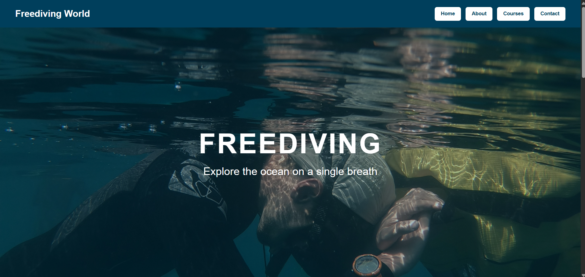
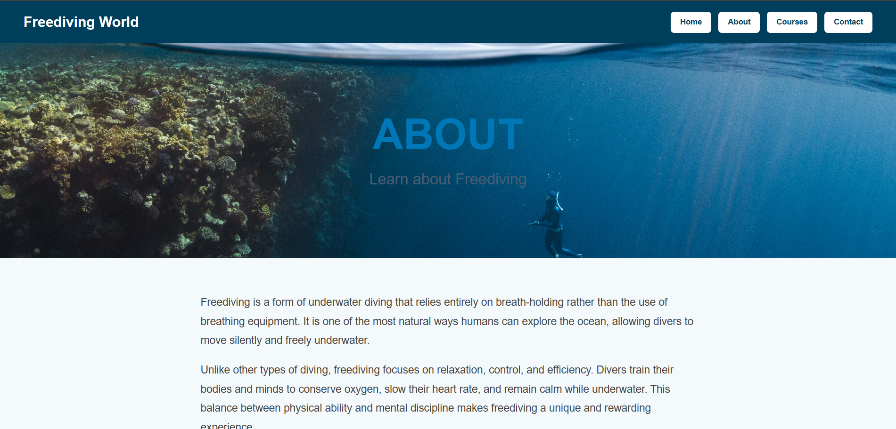
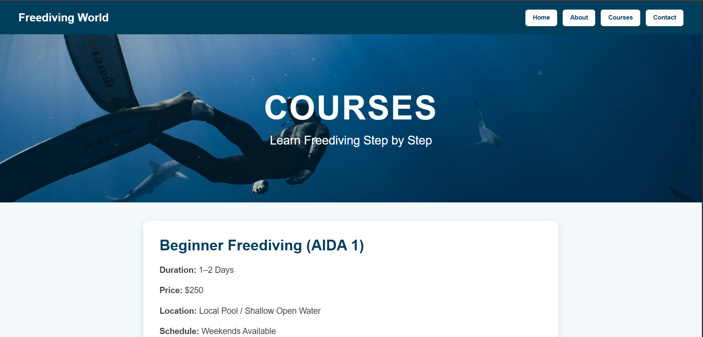
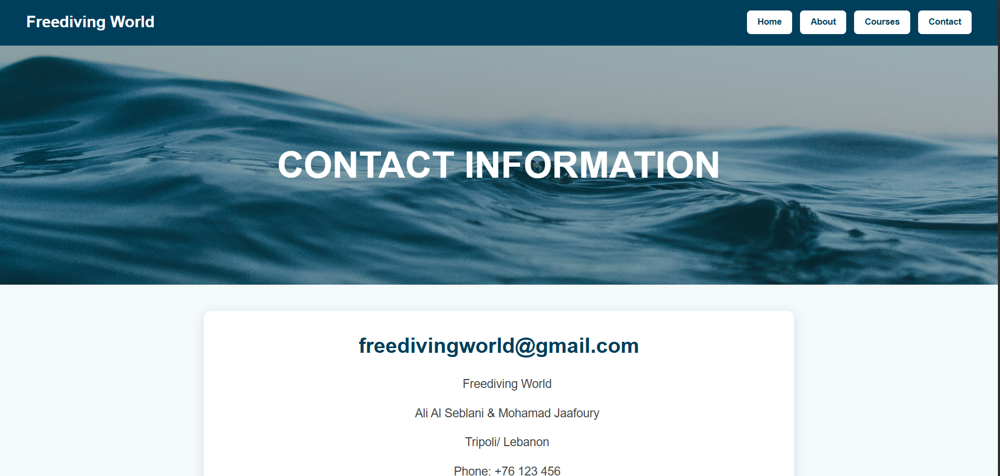
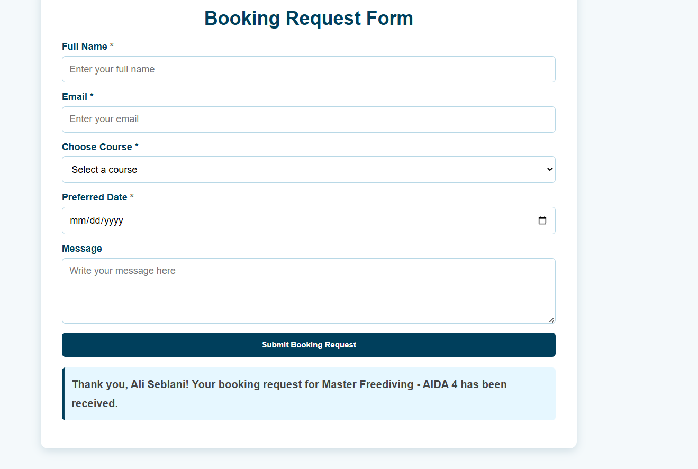

# Freediving World

Freediving World is a ReactJS frontend web application created for the CSCI390 Web Programming Project Phase 2. The project continues the Phase 1 freediving website and converts it into a responsive React application with multiple pages and interactive booking functionality.

## Project Description

This website helps users learn about freediving, explore available freediving courses, and submit a booking request. The application includes information about freediving, course levels, pricing, training details, contact information, and a booking form.

## Features

- ReactJS frontend application
- Four main pages: Home, About, Courses, and Contact
- Responsive design for desktop and mobile screens
- Freediving course information
- Book Now buttons on the Courses page
- Booking request form on the Contact page
- Automatic course selection when booking from the Courses page
- Form validation and confirmation message

## Pages

### Home

Introduces freediving and explains what freediving is, why it is useful, and how it works as a sport.

### About

Provides background information about freediving, its history, freediving today, and the future of the sport.

### Courses

Displays beginner, advanced, and master freediving courses with duration, price, location, schedule, and training details.

### Contact

Shows contact information, booking and payment details, and includes an interactive booking request form.

## Technologies Used

- ReactJS
- JavaScript
- HTML
- CSS
- Vite
- Git and GitHub

## Setup Instructions

To run this project locally:

1. Clone the repository:

```bash
git clone https://github.com/AliAlSeblani16/freediving-world-react.git
```

2. Open the project folder:

```bash
cd freediving-world-react
```

3. Install dependencies:

```bash
npm install
```

4. Start the development server:

```bash
npm run dev
```

5. Open the local server link shown in the terminal, usually:

```text
http://localhost:5173
```

## Build Instructions

To create the production build:

```bash
npm run build
```

## Screenshots

### Home Page



### About Page



### Courses Page



### Contact Page



### Booking Form



## Live Demo

https://freediving-world-react.vercel.app

## GitHub Repository

https://github.com/AliAlSeblani16/freediving-world-react